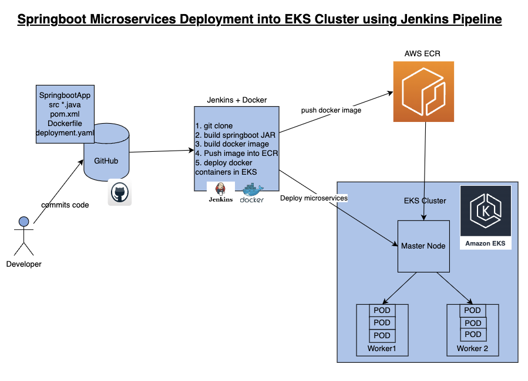

## EKS Deployment 

- Automate SpringBoot microservices builds using Jenkins pipeline and 
- Deploy into AWS EKS Cluster with help of Kubernetes CLI plug-in.
- We will use Springboot Microservices based Java application. 
- Repo : https://github.com/akannan1087/springboot-app

### Steps 
- Automating builds using Jenkins
- Automating Docker image creation
- Automating Docker image upload into AWS ECR
- Automating Docker Containers Deployments to Kubernetes Cluster

|  |   |  | 

### Pre-requisites:
- Amazon EKS Cluster is setup and running. Click here to learn how to create Amazon EKS cluster.
- Create ECR repo in AWS
- Jenkins Master is up and running
- Docker installed on Jenkins instance 
- Docker, Docker pipeline and Kubernetes CLI plug-ins are installed in Jenkins
- Install kubectl on your instance

### Deployment Steps 
- Step # 1 - Create Maven3 variable under Global tool configuration in Jenkins
    - Make sure you create Maven3 variable under Global tool configuration. 
- Step #2 - Create Credentials for connecting to Kubernetes Cluster using kubeconfig
    - Click on Add Credentials, use Kubernetes configuration from drop down.
    - use secret file from drop down.
    - execute the below command to login as jenkins user.
    - sudo su - jenkins
    - you should see the nodes running in EKS cluster.
    - kubectl get nodes
    - Execute the below command to get kubeconfig info, copy the entire content of the file:
    - cat /var/lib/jenkins/.kube/config
    - Open your text editor or notepad, copy and paste the entire content and save in a file.
    - We will upload this file.
    - Enter ID as K8S and choose File and upload the file and save.
    - Enter ID as K8S and choose enter directly and paste the above file content and save.
- Step # 3 - Create a pipeline in Jenkins
    - Create a new pipeline job.
- Step # 4 - Copy the pipeline code from below
    - Make sure you change red highlighted values below as per your settings:
    - Your docker user id should be updated.
    - your registry credentials ID from Jenkins from step # 1 should be copied

~~~shell script
pipeline {
   tools {
        maven 'Maven3'
    }
    agent any
    environment {
        registry = "account_id.dkr.ecr.us-east-1.amazonaws.com/my-docker-repo"
    }
    stages {
        stage('Cloning Git') {
            steps {
                checkout([$class: 'GitSCM', branches: [[name: '*/main']], doGenerateSubmoduleConfigurations: false, extensions: [], submoduleCfg: [], userRemoteConfigs: [[credentialsId: '', url: 'https://github.com/akannan1087/springboot-app']]])     
            }
        }
      stage ('Build') {
          steps {
            sh 'mvn clean install'           
            }
      }
    // Building Docker images
    stage('Building image') {
      steps{
        script {
          dockerImage = docker.build registry 
        }
      }
    }   
    // Uploading Docker images into AWS ECR
    stage('Pushing to ECR') {
     steps{  
         script {
                sh 'aws ecr get-login-password --region us-east-1 | docker login --username AWS --password-stdin account_id.dkr.ecr.us-east-1.amazonaws.com'
                sh 'docker push account_id.dkr.ecr.us-east-1.amazonaws.com/my-docker-repo:latest'
         }
        }
      }
       stage('K8S Deploy') {
        steps{   
            script {
                withKubeConfig([credentialsId: 'K8S', serverUrl: '']) {
                sh ('kubectl apply -f  eks-deploy-k8s.yaml')
                }
            }
        }
       }
    }
}
~~~
- Step # 5 - Build the pipeline
    - Once you create the pipeline and changes values per your configuration, click on Build now:
- Step # 6 - Verify deployments to K8S
    - kubectl get pods
    - kubectl get deployments
    - kubectl get services
    - If you see any errors after deploying the pods, you can check the pod logs.
    - kubectl logs <pod_name>
- Steps # 7 - Access SpringBoot App in K8S cluster
    - Once build is successful, go to browser and enter master or worker node public ip address along with port number mentioned above
    - http://loadbalancer_ip_address

#### eks-deploy-k8s.yaml
~~~yaml
apiVersion: apps/v1
kind: Deployment
metadata:
  labels:
    app: springboot-app
  name: springboot-app
spec:
  replicas: 4
  selector:
    matchLabels:
      app: springboot-app
  template:
    metadata:
      labels:
        app: springboot-app
    spec:
      containers:
      - name: my-springboot-app
        image: 211223789150.dkr.ecr.us-east-1.amazonaws.com/my-springboot-app:latest
        imagePullPolicy: Always
        ports:
        - containerPort: 8085
          name: http
          protocol: TCP
# service type loadbalancer       
---
apiVersion: v1
kind: Service
metadata:
  labels:
    app: springboot-app
    k8s-app: springboot-app
  name: springboot-app
spec:
  ports:
  - name: http
    port: 80
    protocol: TCP
    targetPort: 8085
  type: LoadBalancer
  selector:
    app: springboot-app
~~~